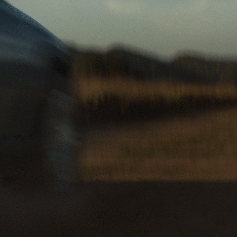
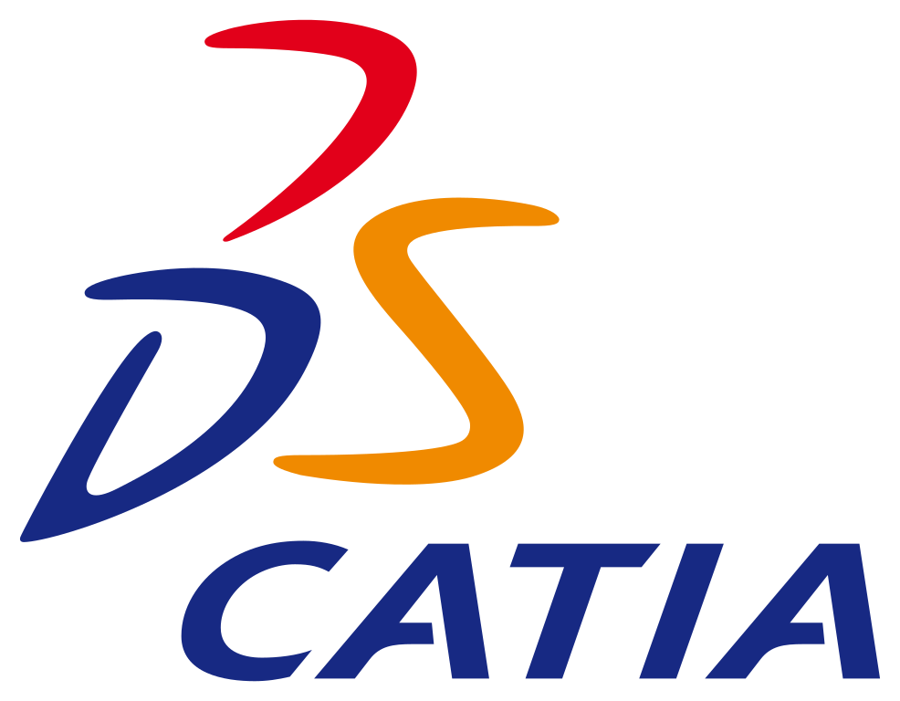

## Hey 👋, I'm Quentin PETIT!

Future mobility engineer, eager to tackle today's transportation challenges.
 
 

  
### About:

- 🚆 &nbsp; I’m currently working for **Alstom**
- 🌱 &nbsp; I’m currently learning propulsion simulation methods; 
- 👨🏻‍💻 &nbsp; Most of my projects are available on [Github](https://github.com/quentinptt?tab=repositories)
- 📫 &nbsp; Feel free to ping me on [LinkedIn](https://www.linkedin.com/in/quentinptt/)
- 📝 &nbsp; Checkout my [resume](https://quentinptt.fr/static/pdf/cv.pdf)
- 📚 &nbsp; When I have free time, I read a lot. Check out my reviews on my [blog](https://quentinptt.fr/tags/livre).

 

### 🔨 Languages and Tools:
 
 
 
 
 
